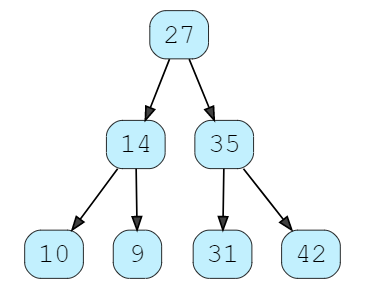

# Tree Data Structure

Trees are non-linear data structures that represent nodes connected by edges. Each tree consists of a root node as the Parent node, and the left node and right node as Child nodes.


### **Why the use of Tree DS?**

Other data structures such as arrays, linked list, stack, and queue are linear data structures that store data sequentially. In order to perform any operation in a linear data structure, the time complexity increases with the increase in the data size. But, it is not acceptable in today's computational world.

### **Tree Terminologies**

**Node**

A node is an entity that contains a key or value and pointers to its child nodes.

The last nodes of each path are called leaf nodes or external nodes that do not contain a link/pointer to child nodes.

The node having at least a child node is called an internal node.

**Edge**

It is the link between any two nodes.


**Root**

It is the topmost node of a tree.

**Height of a Node**

The height of a node is the number of edges from the node to the deepest leaf (ie. the longest path from the node to a leaf node).

**Depth of a Node**

The depth of a node is the number of edges from the root to the node.

**Height of a Tree**

The height of a Tree is the height of the root node or the depth of the deepest node.


**Degree of a Node**

The degree of a node is the total number of branches of that node.

**Forest**

A collection of disjoint trees is called a forest.


### **Types of Tree**

- Binary Tree

- Binary Search Tree

- AVL Tree

- B - Tree

### **Tree Traversal**

Is the act of navigating to a specific node in the tree inorder to perform an operation.

### **Tree Applications**


- Binary Search Trees(BSTs) are used to quickly check whether an element is present in a 
set or not.

- Heap is a kind of tree that is used for heap sort.

- A modified version of a tree called Tries is used in modern routers to store routing 
information.

- Most popular databases use B-Trees and T-Trees, which are variants of the tree 
structure we learned above to store their data.

- Compilers use a syntax tree to validate the syntax of every program you write.

### **Binary Trree**

A tree whose elements have at most two children is called a binary tree. Each element in a binary tree can have only two children. A node’s left child must have a value less than its parent’s value, and the node’s right child must have a value greater than its parent value.



### **Implementing Binary Tree**

```
class Node:
    def __init__(self, val):
        self.val = val
        self.left = None
        self.right = None

class BinarySearchTree:
    def __init__(self, root=None):
        self.root = root

    def insert(self, val):
        node = Node(val)
        if self.root is None:
            self.root = node
        else:
            current = self.root
            while True:
                if val > current.val:
                    if current.right is None:
                        current.right = node
                        return False
                    else:
                        current = current.right
                if val < current.val:
                    if current.left is None:
                        current.left = node
                        return False
                    else:
                        current = current.left
                    
    def lookup(self, val):
        current = self.root
        if val == current.val:
            return (f"{current.val}\n{current.left.val}     {current.right.val}")
        else:
            while True:
                if val > current.val:
                    if current.right.val == val:
                        current = current.right
                        return (f'{current.val} -- left {current.left} -- right {current.right}') 
                    else:
                        current = current.right
                if val < current.val:
                    if current.left.val == val:
                        current = current.left
                        return (f'{current.val} -- left {current.left} -- right {current.right}') 
                    else:
                        current = current.left

    def remove(self, value):
        pass

    def print_tree(self):
        current = self.root
        print(f'{current.val}\n\n{current.left.val}    {current.right.val}')
        l_current = current.left
        r_current = current.right
        print(f'{l_current.left.val}    {l_current.right.val}     {r_current.left.val}    {r_current.right.val}')
```

## Things I want to know more about

- Tree DS

## References

[1] <https://www.educative.io/answers/binary-trees-in-python>

[2] <https://www.programiz.com/dsa/trees>
