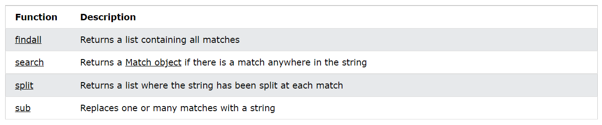
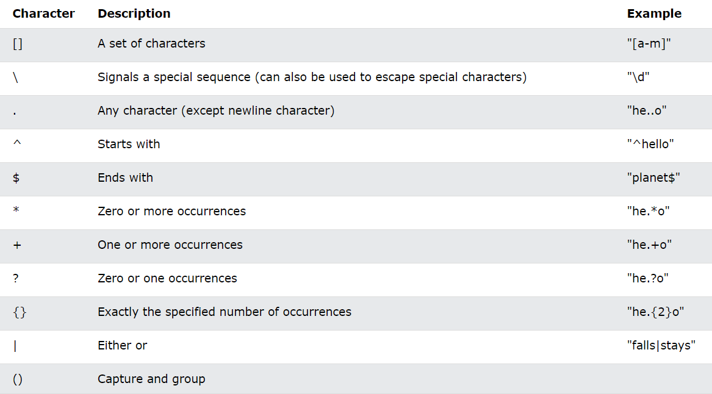
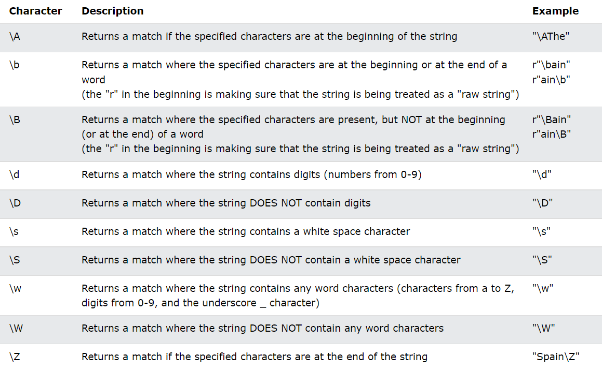
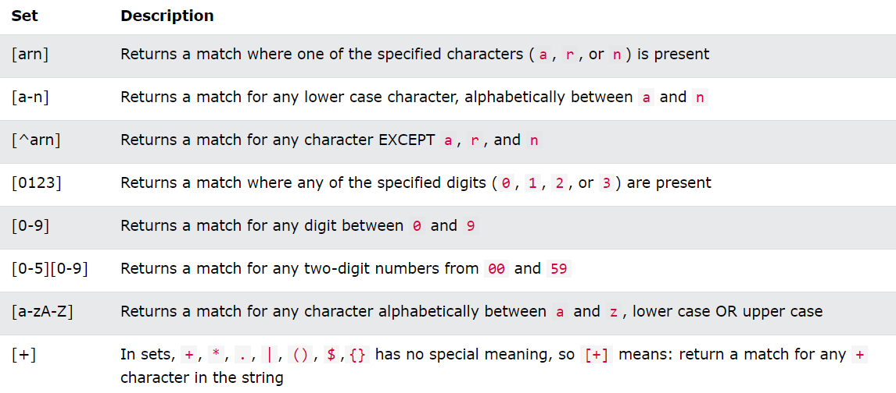

# Automation 

## Python Regular Expression

A RegEx, or Regular Expression, is a sequence of characters that forms a search pattern.

Regular Expressions, often shortened as regex, are a sequence of characters used to check whether a pattern exists in a given text (string) or not. If you've ever used search engines, search and replace tools of word processors and text editors - you've already seen regular expressions in use. They are used at the server side to validate the format of email addresses or passwords during registration, used for parsing text data files to find, replace, or delete certain string, etc. They help in manipulating textual data, which is often a prerequisite for data science projects involving text mining.

**Importing**

```
import re
```

**Regex Functions**



**Metacharacters**



**Special Sequences**

A special sequence is a \ followed by one of the characters in the list below, and has a special meaning:



**Sets**

A set is a set of characters inside a pair of square brackets [ ] with a special meaning:



**Selected Example**

```
import re

#Return a list containing every occurrence of "ai":

txt = "The rain in Spain"
x = re.findall("ai", txt)
print(x)

>> ['ai', 'ai']
```

```
import re

txt = "The rain in Spain"
x = re.search("\s", txt)

print("The first white-space character is located in position:", x.start()) 

>> The first white-space character is located in position: 3

# If no matches are found, the value None is returned
```

```
import re

#The search() function returns a Match object:

txt = "The rain in Spain"
x = re.search("ai", txt)
print(x)

>> <_sre.SRE_Match object; span=(5, 7), match='ai'>

The Match object has properties and methods used to retrieve information about the search, and the result:

.span() returns a tuple containing the start-, and end positions of the match.
.string returns the string passed into the function
.group() returns the part of the string where there was a match
```

```
import re

txt = "The rain in Spain"
x = re.search(r"\bS\w+", txt)
print(x.span())

>> (12, 17)
```

**Group**

re.MatchObject.group() method returns the complete matched subgroup by default or a tuple of matched subgroups depending on the number of arguments

```
Syntax: re.MatchObject.group([group])

Parameter:

group: (optional) group defaults to zero (meaning that it it will return the complete matched string). Return -1 if group exists but did not contribute to the match.
Return: Complete match by default else one or more matched subgroups depending on the arguments.

IndexError: If the group number passed as argument is negative or greater than the number of groups defined in the match pattern then an IndexError exception will be raised

AttributeError: If a matching pattern is not found then it raise AttributeError.

import re
 
"""We create a re.MatchObject and store it in
   match_object variable
   the '()' parenthesis are used to define a
   specific group"""
 
match_object = re.match(r'(\w+)@(\w+)\.(\w+)', 'username@geekforgeeks.org')
 
""" w in above pattern stands for alphabetical character
    + is used to match a consecutive set of characters
    satisfying a given condition
    so w+ will match a consecutive set of alphabetical characters"""
 
# for entire match
print(match_object.group())
# also print(match_object.group(0)) can be used
>> username@geekforgeeks.org 

# for the first parenthesized subgroup
print(match_object.group(1))
>> username

# for the second parenthesized subgroup
print(match_object.group(2))
>> geekforgeeks

# for the third parenthesized subgroup
print(match_object.group(3))
>> org

# for a tuple of all matched subgroups
print(match_object.group(1, 2, 3))
>> ('username', 'geekforgeeks', 'org')
```

## shutil — High-level File Operations

The shutil module includes high-level file operations such as copying and archiving.

**Copying Files**

copyfile() copies the contents of the source to the destination and raises IOError if it does not have permission to write to the destination file.

Because the function opens the input file for reading, regardless of its type, special files (such as Unix device nodes) cannot be copied as new special files with copyfile().

The implementation of copyfile() uses the lower-level function copyfileobj(). While the arguments to copyfile() are filenames, the arguments to copyfileobj() are open file handles. The optional third argument is a buffer length to use for reading in blocks.

The default behavior is to read using large blocks. Use -1 to read all of the input at one time or another positive integer to set a specific block size.

The copy() function interprets the output name like the Unix command line tool cp. If the named destination refers to a directory instead of a file, a new file is created in the directory using the base name of the source.

The permissions of the file are copied along with the contents.

copy2() works like copy(), but includes the access and modification times in the metadata copied to the new file.

**Copying File Metadata**

By default when a new file is created under Unix, it receives permissions based on the umask of the current user. To copy the permissions from one file to another, use copymode().

This example script creates a file to be modified, then uses copymode() to duplicate the permissions of the script to the example file.

To copy other metadata about the file use copystat().

Only the permissions and dates associated with the file are duplicated with copystat().

**Working With Directory Trees**

shutil includes three functions for working with directory trees. To copy a directory from one place to another, use copytree(). It recurses through the source directory tree, copying files to the destination. The destination directory must not exist in advance.

The symlinks argument controls whether symbolic links are copied as links or as files. The default is to copy the contents to new files. If the option is true, new symlinks are created within the destination tree.

copytree() accepts two callable arguments to control its behavior. The ignore argument is called with the name of each directory or subdirectory being copied along with a list of the contents of the directory. It should return a list of items that should be copied. The copy_function argument is called to actually copy the file.

ignore_patterns() is used to create an ignore function to skip copying Python source files. verbose_copy() prints the names of files as they are copied then uses copy2(), the default copy function, to make the copies.

To remove a directory and its contents, use rmtree().

Errors are raised as exceptions by default, but can be ignored if the second argument is true, and a special error handler function can be provided in the third argument.

To move a file or directory from one place to another, use move().

The semantics are similar to those of the Unix command mv. If the source and destination are within the same file system, the source is renamed. Otherwise the source is copied to the destination and then the source is removed.

**Finding Files**

The which() function scans a search path looking for a named file. The typical use case is to find an executable program on the shell’s search path defined in the environment variable PATH.

If no file matching the search parameters can be found, which() returns None.

which() takes arguments to filter based on the permissions the file has, and the search path to examine. The path argument defaults to os.environ('PATH'), but can be any string containing directory names separated by os.pathsep. The mode argument should be a bitmask matching the permissions of the file. By default the mask looks for executable files, but the following example uses a readable bitmask and an alternate search path to find a configuration file.

There is still a race condition searching for readable files this way, because in the time between finding the file and actually trying to use it, the file can be deleted or its permissions can be changed.

**Archives**

Python’s standard library includes many modules for managing archive files such as tarfile and zipfile. There are also several higher-level functions for creating and extracting archives in shutil. get_archive_formats() returns a sequence of names and descriptions for formats supported on the current system.

The formats supported depend on which modules and underlying libraries are available, so the output for this example may change based on where it is run.

Use make_archive() to create a new archive file. Its inputs are designed to best support archiving an entire directory and all of its contents, recursively. By default it uses the current working directory, so that all of the files and subdirectories appear at the top level of the archive. To change that behavior, use the root_dir argument to move to a new relative position on the filesystem and the base_dir argument to specify a directory to add to the archive.

This example starts within the source directory for the examples for shutil and moves up one level in the file system, then adds the shutil directory to a tar archive compressed with gzip. The logging module is configured to show messages from make_archive() about what it is doing.

shutil maintains a registry of formats that can be unpacked on the current system, accessible via get_unpack_formats().

This registry is different from the registry for creating archives because it also includes common file extensions used for each format so that the function for extracting an archive can guess which format to use based on the file extension.

Extract the archive with unpack_archive(), passing the archive file name and optionally the directory where it should be extracted. If no directory is given, the current directory is used.

In this example unpack_archive() is able to determine the format of the archive because the filename ends with tar.gz, and that value is associated with the gztar format in the unpack format registry.

**File System Space**

It can be useful to examine the local file system to see how much space is available before performing a long running operation that may exhaust that space. disk_usage() returns a tuple with the total space, the amount currently being used, and the amount remaining free.

The values returned by disk_usage() are the number of bytes, so the example program converts them to more readable units before printing them.


## Things I want to know more about

- Generating random numbers in computers
- Diffie-Hellman Key Exchange
- Hashing passwords

## References

[1] <https://www.datacamp.com/tutorial/python-regular-expression-tutorial>

[2] <https://www.w3schools.com/python/python_regex.asp>

[3] <https://www.geeksforgeeks.org/re-matchobject-group-function-in-python-regex/>

[4] <https://pymotw.com/3/shutil/>
